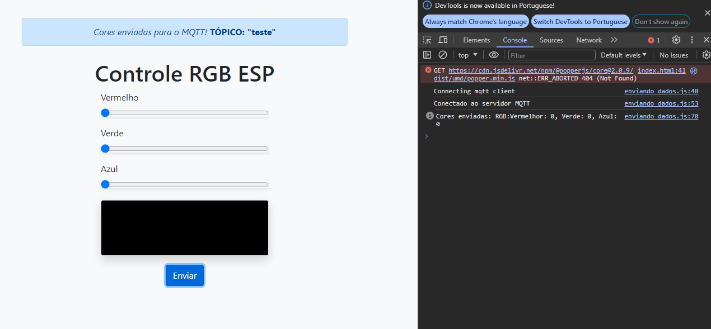
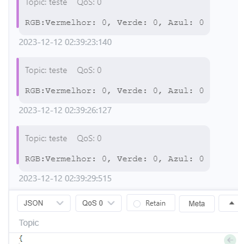

### projeto-IOT
# PROJETO FINAL DE IOT - INTERNET DAS COISAS
## Disciplina da ECT - UFRN
###### Professor Orivaldo
### Alunos
- José Ilson Dos Santos Júnior
- 
-
-

## Resumo do projeto
O intuito do projeto é criar um controlador RGB de uma ou várias leds de um microcontrolador ESP.

Para isso foi criado uma página web com um modele de "Controle" de cores RGB, com tela de visualização.

 - À página reconhece ops valores das cores graças a combinação do `HTML`, ``JAVA SCRITP``, onde é utilizada uma função dentro do arquivo [`enviando_dados.js`](https://github.com/zzjunior/controleRGBWEB_MQTT/blob/main/js/enviando_dados.js) onde são atualizadas as cores de acordo com os valores dos formulários ``HTML``.
###### atualizaCores
 ~~~~javascript
function atualizaCores() {
  var redValue = document.getElementById('redRange').value;
  var greenValue = document.getElementById('greenRange').value;
  var blueValue = document.getElementById('blueRange').value;

  var colorPreview = document.getElementById('colorPreview');
  colorPreview.style.backgroundColor = `rgb(${redValue}, ${greenValue}, ${blueValue})`;
}

document.getElementById('redRange').addEventListener('input', atualizaCores);
document.getElementById('greenRange').addEventListener('input', atualizaCores);
document.getElementById('blueRange').addEventListener('input', atualizaCores);
atualizaCores();
~~~~

 - Após isso é criada uma função ainda no arquivo [`enviando_dados.js`](https://github.com/zzjunior/controleRGBWEB_MQTT/blob/main/js/enviando_dados.js), para criar a conecxão com o servidor `MQTT` ler os dados das cores que são atualizadas na `atualizaCores` e gerar a mensagem que será enviada para o servidor `MQTT`.
 ######  Conexão com MQTT [`enviando_dados.js`](https://github.com/zzjunior/controleRGBWEB_MQTT/blob/main/js/enviando_dados.js)
 ~~~javascript
const clientId = 'mqttjs_' + Math.random().toString(16).substr(2, 8)
const host = 'wss://mqtt.ect.ufrn.br:8083/mqtt'
const publishTopic = 'teste';
const options = {
  keepalive: 60,
  clientId: clientId,
  protocolId: 'MQTT',
  protocolVersion: 4,
  clean: true,
  reconnectPeriod: 1000,
  connectTimeout: 30 * 1000,
  username: "mqtt",
  password: "lar_mqtt",
  will: {
    topic: 'teste',
    payload: 'Connection Closed abnormally..!',
    qos: 0,
    retain: false
  }
};
console.log('Connecting mqtt client');
const client = mqtt.connect(host, options);
client.on('error', err => {
  console.log('Connection error: ', err);
  client.end();
});
client.on('reconnect', () => {
  console.log('Reconnecting...');
});
client.on('connect', function () {
  console.log('Conectado ao servidor MQTT');
});
~~~
###### Gerando mensagem e enviando dados ao servidor MQTT [`enviando_dados.js`](https://github.com/zzjunior/controleRGBWEB_MQTT/blob/main/js/enviando_dados.js)
~~~javascript
document.getElementById('enviarCores').addEventListener('click', function () {
  var redValue = document.getElementById('redRange').value;
  var greenValue = document.getElementById('greenRange').value;
  var blueValue = document.getElementById('blueRange').value;

  var msg = `RGB:Vermelho: ${redValue}, Verde: ${greenValue}, Azul: ${blueValue}`;

  client.publish(publishTopic, msg, { qos: 0, retain: false });
~~~

 - Após enviadas as informações é gerado um alerta informando que as cores foram enviadas e para qual ``TÓPICO`` do ``MQTT``, também é gerado um log no ``Devtools`` com a mensagem enviada.
###### Alertas de envio no MQTT [`enviando_dados.js`](https://github.com/zzjunior/controleRGBWEB_MQTT/blob/main/js/enviando_dados.js)
~~~javascript
console.log('Cores enviadas:', msg);

  var alertEnvio = document.getElementById('alerta-de-envio');
  var efeitotime = alertEnvio.style.display || window.getComputedStyle(alertEnvio).display;
  alertEnvio.style.display = 'block';
  setTimeout(function () {
    alertEnvio.style.display = efeitotime;
  }, 2000);
~~~

 ##### Tela com DevTools e Alerta de envio

##### MQTTX com mensagens no TÓPICO USADO

 
O que nos ajudou?

 [Biblioteca Paho - JS](https://www.hivemq.com/article/mqtt-client-library-encyclopedia-paho-js/)

 [Bootstrap](https://getbootstrap.com/docs/5.3)

 [Java Script](https://developer.mozilla.org/pt-BR/docs/Web/JavaScript)

 [W3 Schools - JS](https://www.w3schools.com/jsrEF/default.asp)

 [Repositório de IOT - Professor Orivaldo](https://github.com/orivaldosantana/ura_html_panel/blob/main/test_mqtt_js.html)

